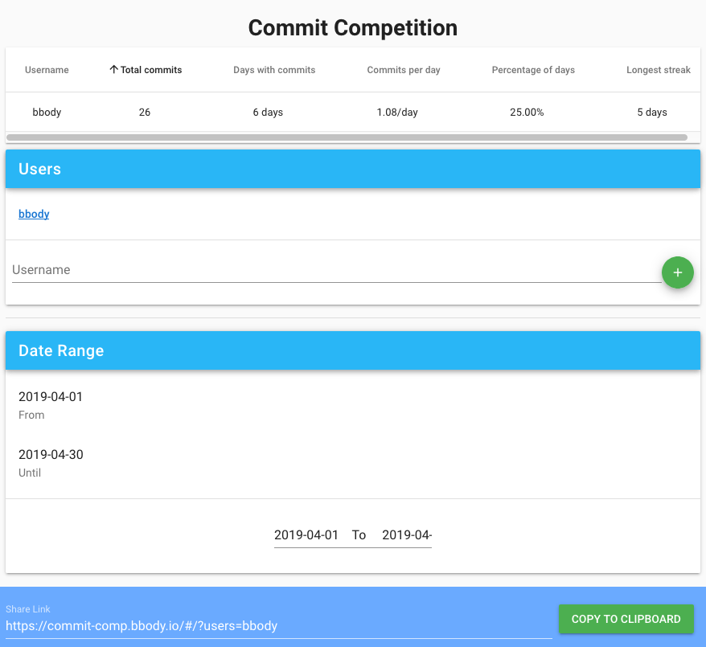

# Commit Comp

[](https://travis-ci.org/bbody/commit-comp)
[](https://coveralls.io/github/bbody/commit-comp?branch=master)
[](https://david-dm.org/)

App to track Github commit competitions ([Read more](https://www.brendonbody.com/2019/04/28/commit-competition/)), can view and rank by:

- Total commits
- Days with commits
- Commits per day
- Percentage of days
- Longest streak

[Demo](https://commit-comp.bbody.io)



## Built with

- [VueJS](https://vuejs.org/)
- [TypeScript](https://www.typescriptlang.org/)
- [Yarn](https://yarnpkg.com/)
- [Vuetify](https://vuetifyjs.com/)
- [VueX](https://vuex.vuejs.org/)
- [TSLint](https://palantir.github.io/tslint/)
- [Jest](https://jestjs.io/)
- [Cypress](https://www.cypress.io/)
- [MomentJS](https://momentjs.com/)
- [Travis](https://travis-ci.org/)

## Project setup
```
yarn install
```

### Compiles and hot-reloads for development
```
yarn run serve
```

### Compiles and minifies for production
```
yarn run build
```

### Run your tests
```
yarn run test
```

### Lints and fixes files
```
yarn run lint
```

### Run your end-to-end tests
```
yarn run test:e2e
```

### Run your unit tests
```
yarn run test:unit
```

### Customize configuration
See [Configuration Reference](https://cli.vuejs.org/config/).
